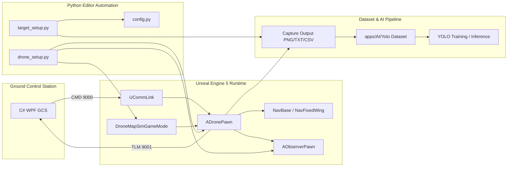
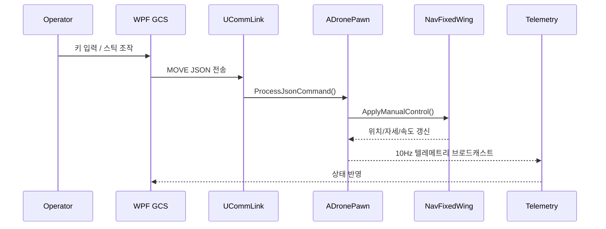
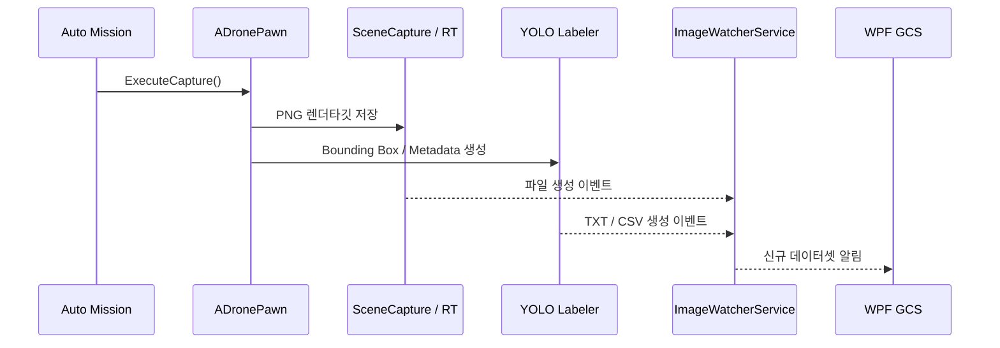
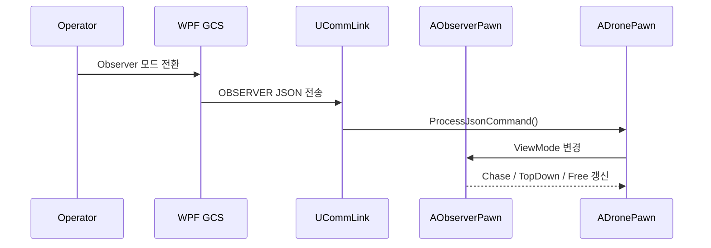
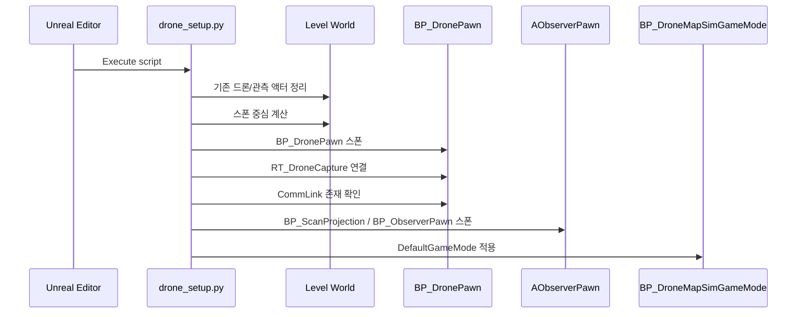
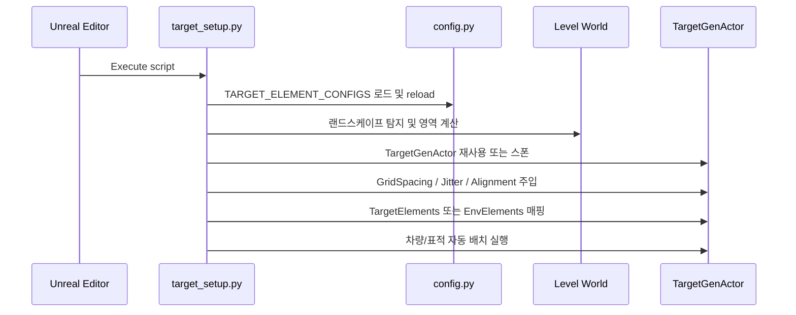

# Drone Camera Simulator & Autonomous Digital Tactical Mapping System

---

## 1. 프로젝트 개요 및 아키텍처

### 1.1. 프로젝트 목적 및 핵심 개발 방향
- **드론 항공 카메라 기반 지상 객체 식별, 자율 수색 비행, 전술 지도 생성 파이프라인 구축**
  - **비행 제어**: UE5 C++ 기반 고정익 비행 물리, 뱅킹 턴, 2축 짐벌, 관찰자 시점 전환
  - **통신**: UE5 시뮬레이터와 GCS 간 UDP JSON 기반 양방향 제어/텔레메트리
  - **데이터 수집**: 렌더타깃 이미지, YOLO 라벨, 비행 메타데이터 자동 생성
  - **AI 연동**: GPU 가속 YOLOv8 학습 및 실시간 객체 탐지
  - **전술 매핑**: 역투영, 클러스터링, 정사 모자이크 기반 지도 생성

### 1.2. 개발 환경
- **Engine**: Unreal Engine 5.7
- **Language / IDE**: C++ (Visual Studio 2022), C# (.NET 8 / WPF GCS), Python 3.10+
- **Deep Learning / AI**: PyTorch (CUDA 12.x 가속), Ultralytics YOLOv8, OpenCV
- **Hardware Acceleration**: NVIDIA GeForce RTX 5070 (12GB VRAM)

### 1.3. 핵심 설계 원칙 (Architecture Principles)
- **순수 C++ 항법 엔진 분리 (Engine-Agnostic Navigation Engine)**:
  - 언리얼 종속성을 배제한 순수 C++ 클래스(`NavBase`, `NavFixedWing`)로 항법과 물리를 분리한다.
  - `ADronePawn`은 매 틱 `NavEngine->Step()` 결과만 반영한다.
- **단일 창구 입력 체계 (Single Entry-Point Command Flow)**:
  - 모든 입력은 동일한 JSON 규격으로 변환하고 `UCommLink::ProcessJsonCommand()`로 집약한다.
- **실제 항공기 조타면 역학 (Aero Surface Inertia & Auto-Decay)**:
  - 내부 필터와 자동 중립 복귀를 통해 조타면 반응과 복귀를 유지한다.
- **절대 해수면 고도(MSL) 표준화**:
  - 텔레메트리와 항법의 기준 고도는 MSL로 통일한다.

### 1.4. 시스템 컨텍스트 및 경계 다이어그램


### 1.5. 시스템 책임 분리 원칙
- **UE5 Runtime**: 비행, 카메라, 텔레메트리, 캡처 수행
- **Navigation Core**: 위치, 자세, 속도 계산 수행
- **GCS Layer**: 입력, 임무 전송, 상태 표시 수행
- **Dataset Pipeline**: 캡처 산출물 수집 및 학습 데이터 변환 수행

---

## 2. 핵심 구현 현황

### 2.1. 순수 C++ 고정익 항법 엔진 (`NavBase.h`, `NavFixedWing.h / .cpp`)
- **계층형 네이밍 규칙**: `NavBase`, `NavFixedWing` (향후 `NavMulticopter`, `NavVTOL` 확장)
- **속도 제어**: 최소 10 m/s, 최대 30 m/s 범위에서 스로틀을 조정한다.
- **공기역학적 연동 선회 (Coordinated Bank-Turn)**:
  - Roll 입력에 따라 기체를 최대 40도까지 기울이고, 뱅크각에 비례해 Yaw를 보정한다:
    $$\text{TurnRate} = \left(\frac{\text{Roll}}{40^\circ}\right) \times 45^\circ/\text{s} + \text{RudderRate}$$
- **조타 입력 자체 스무딩 및 자동 중립 감쇠**:
  - 입력이 중단되면 조타면을 중립으로 복원한다.

### 2.2. 언리얼 비행체 및 통신 컴포넌트 (`ADronePawn`, `UCommLink`)
- **`ADronePawn` 경량화**: `NavEngine`과 `ApplyManualControl()`만 유지한다.
- **`UCommLink` 입력 일원화**: 모든 입력을 JSON 명령(`MOVE`, `GIMBAL`, `CAPTURE`, `OBSERVER`)으로 변환한다.
- **텔레메트리 송신**: 10Hz로 MSL 기준 상태를 송신한다.

### 2.3. C# WPF GCS 연동 (`MainWindowVM.cs`, `DroneCommands.cs`)
- **표준 비행 조종 규격**: `MoveCommand(forward, right, pitch, yaw)`를 정규화 단위로 통합한다.
- **스틱 상태 기반 제어**: 키 입력 상태에 따라 조타와 복귀를 처리한다.
- **텔레메트리 연동**: Roll, Yaw, MSL 고도를 표시한다.

### 2.4. 모듈 책임 분리 상세

| 모듈 | 책임 | 입력 | 출력 | 비고 |
| :--- | :--- | :--- | :--- | :--- |
| `NavBase` / `NavFixedWing` | 항법, 속도, 자세, 웨이포인트 추종 | 목표 위치, 조종 입력, 시간 델타 | 위치, 속도, 각도 | Unreal 비종속 |
| `ADronePawn` | 액터 상태 반영, 입력 브릿지 | `NavEngine` 결과, 수동 입력 | Transform, 상태 플래그 | 최소 책임 |
| `UCommLink` | UDP 수신/송신, 명령 파싱 | GCS JSON, 키보드 이벤트 | 명령, 텔레메트리 | 단일 진입점 |
| `AObserverPawn` | 추적/고정 시점 렌더링 | 드론 위치, 모드 전환 | 카메라 뷰포인트 | 비행과 분리 |
| `MainWindowVM` | GCS UI 상태 관리 | 텔레메트리, 사용자 조작 | UI 바인딩, 명령 요청 | 시각화 중심 |
| `DroneCommands` | GCS 명령 모델 정의 | UI 입력 | JSON 데이터 | 계약 보존 |
| `ImageWatcherService` | 캡처 파일 감시 및 후처리 | PNG/TXT/CSV 생성 이벤트 | 데이터셋 등록, 알림 | 비동기 처리 |
| `drone_setup.py` | 드론/관찰자/게임모드 배치 | 에디터 월드, 에셋 레지스트리 | BP_DronePawn, BP_ObserverPawn, RT 연결 | 초기화 자동화 |
| `target_setup.py` | 타깃/차량 배치 및 파라미터 주입 | config.py, 랜드스케이프, TargetGenActor | TargetElements, EnvElements, 표적 | 절차적 생성 |

### 2.5. 대표 시퀀스 흐름

#### 2.5.1. 수동 조종 시퀀스


#### 2.5.2. 자동 촬영 및 라벨 저장 시퀀스


#### 2.5.3. 관찰자 시점 전환 시퀀스


### 2.6. 파이썬 에디터 자동화 시퀀스

#### 2.6.1. 드론 배치 및 캡처 준비 시퀀스 (`drone_setup.py`)


#### 2.6.2. 타깃 배치 및 표적 파라미터 주입 시퀀스 (`target_setup.py`)


#### 2.6.3. Python 스크립트 책임 분리
- **`drone_setup.py`**: 드론 비행 환경, 관찰자, 스캔 프레임, 캡처 타깃, 게임모드를 한 번에 초기화하는 에디터 셋업 스크립트
- **`target_setup.py`**: 지형 범위와 `config.py` 기반 표적 설정을 읽어 차량 및 목표물을 절차적으로 배치하는 데이터 생성 스크립트
  - **공통점**: 반복 실행 시 기존 잔여물을 정리한 뒤 재구성한다.
  - **차이점**: `drone_setup.py`는 실행 인프라를 구성하고, `target_setup.py`는 대상 데이터를 생성한다.

---

## 3. 통신 프로토콜 규격 (Port: 9000 CMD / 9001 TLM)

### 3.1. 제어 명령 패킷 (GCS / Keyboard ➔ Unreal C++, Port: 9000)
- **`MOVE` (수동 비행 조타)**:
  ```json
  {"id":"MOVE", "forward": 1.0, "right": -1.0, "pitch": 0.0, "yaw": 0.0}
  ```
  *(forward: 스로틀, right: Roll, pitch: Pitch, yaw: Yaw)*
- **`GIMBAL` (2축 짐벌 각도 제어)**:
  ```json
  {"id":"GIMBAL", "up": 5, "right": 0}
  ```
- **`CAPTURE` (즉시 렌더타깃 이미지 & YOLO 라벨 저장)**:
  ```json
  {"id":"CAPTURE"}
  ```
- **`OBSERVER` (관찰자 시점 Chase / TopDown / Free 순환)**:
  ```json
  {"id":"OBSERVER"}
  ```

### 3.2. 텔레메트리 패킷 (Unreal C++ ➔ GCS, Port: 9001)
```json
{
  "id": "TELEMETRY",
  "seq": 1520,
  "loc_x": 12.5, "loc_y": -4.2, "loc_z": 100.0,
  "rot_pitch": 2.1, "rot_yaw": 85.4, "rot_roll": -24.8,
  "gimbal_pitch": -90.0, "gimbal_yaw": 0.0,
  "speed": 15.0,
  "mode": "MANUAL"
}
```
*(loc_z는 MSL 기준 고도 미터 단위)*

---

## 4. 새로운 세션에서 진행할 핵심 개발 과제 (Next Steps)

1. **순수 C++ 고정익 자율 항법 복구 및 통합 (`NavFixedWing`)**:
  - `INavBase`에 `StartMission(const TArray<FWaypointItemData>& Waypoints)` 추가
  - 3m 반경 도달 시 다음 웨이포인트로 전환
  - 마지막 웨이포인트 이후 40m 반경 loiter 모드 적용
2. **자동 촬영(Periodic Capture) 및 YOLO 데이터셋 파이프라인 연계**:
  - 자율 비행 중 주기적으로 `ExecuteCapture()` 실행
  - 생성 산출물을 `ImageWatcherService`로 감시하고 GCS에 반영
3. **C# WPF GCS 전술 지도(Tactical Map) 위 웨이포인트 가시화**:
  - 드론 위치와 헤딩을 지도 캔버스에 표시
  - Search Grid와 비행 궤적을 시각화

---

## 5. 런타임 상태 모델 및 처리 순서

### 5.1. 비행 상태(State) 정의
- **MANUAL**: 수동 조작 우선 상태
- **AUTO**: 웨이포인트 추종 및 자율 수색 상태
- **HOVER**: 현재 위치와 고도 유지 상태
- **OBSERVER**: 카메라 전환 보조 상태

### 5.2. 명령 처리 우선순위
1. 안전 정지 명령을 최우선으로 처리한다.
2. 수동 명령은 자율 명령보다 우선한다.
3. `MOVE` 입력 수신 시 자율 경로를 중단하고 수동 제어로 전환한다.
4. `GIMBAL`, `OBSERVER`, `CAPTURE`는 비행 상태와 분리하여 처리한다.

### 5.3. UE5 내부 처리 순서
- 입력 수신: `UCommLink`가 UDP JSON 패킷을 수신한다.
- 해석 단계: `ProcessJsonCommand()`에서 `id` 기준으로 분기한다.
- 상태 반영: `ADronePawn`이 입력 또는 목표를 `NavEngine`에 전달한다.
- 프레임 갱신: `Tick()`에서 위치, 자세, 짐벌, 관찰자 상태를 동기화한다.
- 텔레메트리 송신: 10Hz 주기로 GCS에 상태를 송신한다.

---

## 6. 데이터 산출물 및 저장 규격

### 6.1. 캡처 산출물
- **이미지**: 렌더타깃 기반 PNG 저장
- **라벨**: YOLO 형식의 2D Bounding Box `.txt` 저장
- **메타데이터**: 비행 위치, 자세, 짐벌, 속도, 타임스탬프를 CSV로 저장

### 6.2. 권장 폴더 구조
```text
apps/AI/Yolo/
  YoloDataset/
    images/
    labels/
    meta/
  runs/
  weights/
```

### 6.3. 파일 네이밍 원칙
- 파일명은 **세션 ID + 시퀀스 번호 + 타임스탬프** 조합을 사용한다.
- 이미지, 라벨, CSV는 동일한 베이스 파일명을 사용한다.
- 자동 생성 산출물은 수동 편집하지 않는다.

### 6.4. 데이터 품질 기준
- 라벨이 없는 프레임은 별도 플래그로 구분한다.
- 급격한 자세 변화 구간은 캡처 빈도를 낮춘다.
- 카메라 각도와 MSL 고도는 메타데이터에 기록한다.

---

## 7. 검증 기준 및 향후 리스크

### 7.1. 기능 검증 기준
- `MOVE` 수신 후 자세와 속도는 1초 이내에 수렴해야 한다.
- `CAPTURE` 수행 시 이미지, 라벨, 메타데이터가 동시에 생성되어야 한다.
- 텔레메트리 `seq`는 증가해야 하며, GCS는 누락/중복을 식별할 수 있어야 한다.
- 관찰자 시점 전환은 비행 제어와 충돌하지 않아야 한다.

### 7.2. 리스크 항목
- UDP 기반 통신은 패킷 손실을 전제로 설계해야 한다.
- 고도와 화각에 따른 파라미터 프리셋이 필요하다.
- AI 라벨링 품질을 고려해 자동 캡처 조건을 제한해야 한다.

### 7.3. 다음 보완 우선순위
1. 웨이포인트 미션 API와 경로 생성 로직을 구체화한다.
2. 캡처 파이프라인의 감시 및 재처리 규칙을 정리한다.
3. 전술 지도 좌표계, 스케일, 아이콘 규격을 확정한다.

---

## 8. 추가 운영 사항 및 확장 포인트

### 8.1. Python 설정 원칙
- `config.py`는 드론/타깃/식생 배치의 단일 소스 기준(SSOT)으로 유지한다.
- `target_setup.py`는 실행 시 `importlib.reload(config)`를 수행하여 최신 설정을 다시 읽는다.
- `drone_setup.py`는 에디터 장면 초기화와 액터 연결만 담당하고, 배치 파라미터는 가급적 `config.py`에 두지 않는다.

### 8.2. 드론 배치 규칙
- `drone_setup.py`는 기존 `BP_DronePawn`, `BP_ScanProjection`, `AObserverPawn`, `CommLink` 잔여 액터를 먼저 정리한 뒤 다시 배치한다.
- 드론 배치 후에는 `RT_DroneCapture`, `CommLink`, `BP_DroneMapSimGameMode` 연결 상태를 반드시 확인한다.
- 반복 실행 시 동일 레벨에서 중복 스폰이 발생하지 않도록 멱등성을 유지한다.

### 8.3. 타깃 배치 규칙
- `target_setup.py`는 랜드스케이프가 있으면 지형 중심과 범위를 기준으로, 없으면 기본 원점과 기본 영역을 사용한다.
- `TargetGenActor`가 이미 존재하면 재사용하고, 없으면 새로 스폰한다.
- `GridSpacing`, `PositionJitter`, `AlignToSurfaceNormal` 값은 표적 밀도와 경사면 적합성을 직접 좌우하므로 데이터셋 품질에 맞춰 조정한다.
- `b_is_target=True` 항목은 학습용 표적, `False` 항목은 배경/비표적 또는 일반 객체로 취급한다.

### 8.4. 표적 클래스 및 파라미터 해석
- `mesh_name`은 실제 배치할 메시의 식별자이며, `mesh_path`는 직접 로드 경로로 우선 사용한다.
- `target_class_id`는 클래스 분류용 정수 ID이며, 차량 계열 확장 시 클래스 사전을 함께 관리해야 한다.
- `scale_min` / `scale_max`는 월드 내 객체 크기 변이를 의미하므로 과도한 확장은 라벨 품질 저하로 이어질 수 있다.

### 8.5. 운영 체크리스트
1. `drone_setup.py` 실행으로 비행/캡처 인프라를 먼저 준비한다.
2. `target_setup.py` 실행으로 차량/표적을 배치한다.
3. UE5에서 Play 또는 Simulate를 실행하고 텔레메트리와 캡처가 정상인지 확인한다.
4. `CAPTURE` 결과가 PNG/TXT/CSV로 모두 저장되는지 확인한다.
5. GCS에서 위치, 자세, 관찰자 모드, 짐벌 상태가 일치하는지 확인한다.

### 8.6. 향후 확장 포인트
- 차량 외에도 보행자, 장애물, 구조물 등 새로운 `TARGET_ELEMENT_CONFIGS` 항목을 추가할 수 있다.
- 수색 임무별로 `Search Grid`, `Loiter`, `Line Sweep` 같은 프리셋을 추가할 수 있다.
- 데이터셋 규모가 커지면 캡처 산출물 인덱싱과 중복 제거 규칙을 별도 모듈로 분리하는 것이 바람직하다.

---

## 9. 빠진 항목 체크리스트

### 9.1. 임무 운용
- [ ] 웨이포인트 기반 미션의 시작, 진행, 종료를 관리하는 상위 상태기가 필요하다.
- [ ] `WaypointItemData`와 자율 항법 간 연결 계층이 필요하다.
- [ ] 도달 판정, 경로 전환, loiter, abort, resume 규칙의 정립이 필요하다.
- [ ] 수동-자율 전환 조건의 명문화가 필요하다.

### 9.2. 데이터셋 파이프라인
- [ ] 캡처 산출물의 파일명 규격을 통일할 필요가 있다.
- [ ] train / val / test 분리 정책을 정의할 필요가 있다.
- [ ] 중복 제거, 저품질 프레임 필터링, 재처리 규칙을 정의할 필요가 있다.
- [ ] `target_setup.py` 생성 결과를 학습 데이터셋과 연결하는 인덱싱 단계가 필요하다.
- [ ] 데이터셋 버전 관리와 재현성 기준이 필요하다.

### 9.3. 통신 프로토콜
- [ ] `CommLink` JSON 스키마의 버전 관리가 필요하다.
- [ ] 패킷 오류, 누락 필드, 형식 오류 처리 규칙이 필요하다.
- [ ] sequence 기반 누락 감지 및 중복 처리 규칙이 필요하다.
- [ ] 명령 ACK 또는 실패 응답 규격이 필요하다.
- [ ] 수동 명령과 자동 명령의 우선순위 규칙이 필요하다.

### 9.4. Python 에디터 자동화
- [ ] `drone_setup.py`와 `target_setup.py`의 실행 순서와 복구 정책이 필요하다.
- [ ] `config.py`의 책임 범위를 명확히 정의할 필요가 있다.
- [ ] 반복 실행 시 idempotent 보장 범위를 명시할 필요가 있다.
- [ ] 에디터 실행 후 최종 상태 검증 기준이 필요하다.

### 9.5. 검증 및 운영
- [ ] 기능별 smoke test 기준이 필요하다.
- [ ] 캡처, 라벨, 텔레메트리 자동 점검 절차가 필요하다.
- [ ] 레벨 초기화 순서의 표준화가 필요하다.
- [ ] 장애 대응용 운영 체크리스트가 필요하다.

---

## 10. 다음 개발 우선순위 설계안

### 10.1. 1순위: 미션 오케스트레이터 추가
현재 구조에는 [apps/engine/Source/DroneMapSim/Public/NavBase.h](../apps/engine/Source/DroneMapSim/Public/NavBase.h), [apps/engine/Source/DroneMapSim/Public/NavFixedWing.h](../apps/engine/Source/DroneMapSim/Public/NavFixedWing.h), [apps/engine/Source/DroneMapSim/Public/WaypointItemData.h](../apps/engine/Source/DroneMapSim/Public/WaypointItemData.h) 를 통합하는 상위 미션 계층이 없다.
우선 미션 실행과 상태 전이를 담당하는 오케스트레이터를 추가해야 한다.

권장 설계:
- `UMissionManager` 또는 `UWaypointMissionComponent`
- 책임: 미션 시작, waypoint 진행, 도달 판정, loiter 진입, 중단, 복귀
- 입력: `FWaypointItemData` 배열, 현재 드론 상태, 수동 override 신호
- 출력: 다음 목표점, 현재 미션 상태, 완료 플래그

이 단계가 선행되어야 자율 항법, 캡처, 지도 가시화를 단일 임무 흐름으로 통합할 수 있다.

### 10.2. 2순위: 데이터셋 관리 계층 추가
현재 [apps/engine/Source/DroneMapSim/Public/TargetGenActor.h](../apps/engine/Source/DroneMapSim/Public/TargetGenActor.h) 와 [apps/engine/pyscript/target_setup.py](../apps/engine/pyscript/target_setup.py) 는 표적 생성까지 담당하나, 학습용 데이터 정리 계층이 부족하다.

권장 설계:
- `UDatasetManifestService` 또는 Python 후처리 스크립트 세트
- 책임: 캡처 파일 수집, 파일명 표준화, 메타데이터 인덱싱, train/val 분리, 중복 제거
- 입력: PNG, TXT, CSV, 대상 클래스 정보
- 출력: 학습용 데이터셋 디렉터리와 manifest 파일

이 단계는 데이터셋 재현성과 학습 비교 가능성을 확보하기 위해 필요하다.

### 10.3. 3순위: 통신 프로토콜 정리
현재 [apps/engine/Source/DroneMapSim/Public/CommLink.h](../apps/engine/Source/DroneMapSim/Public/CommLink.h) 는 송수신 기반은 있으나, 프로토콜 계약이 느슨하다.

권장 설계:
- 명령 버전 필드 추가
- 필수 필드 검증
- 수신 오류 응답 규격 추가
- sequence 및 timestamp 기반 상태 동기화
- 수동 명령과 자율 명령 우선순위 명문화

이 단계는 명령 증가에 따른 디버깅 비용을 억제하고, GCS-UE 계약을 고정하기 위해 필요하다.

### 10.4. 4순위: Python 셋업 스크립트 정리
[apps/engine/pyscript/drone_setup.py](../apps/engine/pyscript/drone_setup.py) 와 [apps/engine/pyscript/target_setup.py](../apps/engine/pyscript/target_setup.py) 의 역할은 적절하나, 운영 안정성을 위해 경계를 명확히 해야 한다.

권장 설계:
- `drone_setup.py`: 비행 인프라 전용, 드론/관찰자/게임모드/캡처 연결만 담당
- `target_setup.py`: 표적 배치 전용, 랜드스케이프 분석과 타깃 생성만 담당
- `config.py`: 경로, 에셋 이름, 배치 파라미터, 클래스 ID만 보유
- 공통: 멱등성, 실패 시 롤백, 재실행 가능성 보장

이 단계는 반복 실행 안정성과 유지보수성을 확보하기 위해 필요하다.

### 10.5. 5순위: 운영 검증 자동화
마지막으로, 전체 흐름을 확인하는 검증 절차를 문서와 스크립트에 반영해야 한다.

권장 설계:
- 드론 배치 검증
- 타깃 배치 검증
- 텔레메트리 송신 검증
- 캡처 파일 생성 검증
- 라벨 생성 검증
- GCS 반영 검증

이 단계는 기능 단위 검증과 최종 통합 검증을 확보하기 위해 필요하다.
