# Target Generation & Ground Truth Pipeline Flow (`TargetGenActor`)
> **문서 목적**: `config.py`와 `target_setup.py`에서 시작하여 언리얼 C++ `ATargetGenActor`를 거쳐 지형 위 차량/표적 배치, 바다(WaterBody) 영역 필터링, AI 추론용 Ground Truth(`SpawnedTargets`) 생성 및 `.umap` 영구 보존/복원에 이르는 전체 플로우를 정의합니다.

---

## 1. 전체 파이프라인 개요 (End-to-End Overview)

타겟 정보 생성 파이프라인은 크게 **5단계(Phase)**로 동작하며, **최초 1회 생성 후 레벨(`.umap`)에 영구 박제**되어 이후 언리얼 에디터를 다시 열거나 게임을 실행(`BeginPlay`)할 때 재초기화 없이 즉시 완성된 상태를 유지합니다.

```mermaid
flowchart TD
  subgraph PY_INIT["Phase 1. Python 설정 로드 및 주입 (target_setup.py)"]
    CFG["config.py (SSOT)<br/>TARGET_GEN_PARAMS / TARGET_ELEMENT_CONFIGS"]
    LAND["월드 Landscape 감지<br/>스폰 중심 및 영역(AreaExtent) 계산"]
    ACTOR["TargetGenActor 탐색 또는 스폰"]
    MESH["StaticMesh 에셋 검증 및 로드<br/>FTargetConfig 배열 생성"]
    INJECT["target_actor.set_editor_property('TargetElements', ...)"]
    
    CFG --> LAND --> ACTOR --> MESH --> INJECT
  end

  subgraph CPP_GEN["Phase 2. C++ 지형 스캔 및 HISM 배치 (GenerateTarget)"]
    BOUNDS["GetTotalLandscapeBounds()<br/>전체 지형 Min/Max 바운드 계산"]
    HISM_SETUP["SetupHISMComponents()<br/>Instance 방식 HISM 컴포넌트 생성"]
    GRID["GridSpacing + PositionJitter 기반<br/>2D 샘플링 좌표 생성"]
    TRACE["LineTraceSingleByChannel()<br/>지면 충돌점 및 법선(SurfaceNormal) 획득"]
    FILTER["경사각(SlopeAngle <= MaxSlopeAngle)<br/>및 가중치(SpawnWeight) 확률 판정"]
    ADD_INST["바닥면 Z-Offset 보정 후<br/>TargetHISM->AddInstance()"]

    BOUNDS --> HISM_SETUP --> GRID --> TRACE --> FILTER --> ADD_INST
  end

  subgraph PY_WATER["Phase 3. 바다 영역 후처리 (target_setup.py)"]
    WATER_FIND["월드 내 WaterBody 액터 수집<br/>2D 경계(Margin 포함) 계산"]
    WATER_REM["HISM 인스턴스 전수 검사 후<br/>바다 영역 내 차량 역순 제거 (remove_instance)"]

    WATER_FIND --> WATER_REM
  end

  subgraph CPP_BAKE["Phase 4. 최종 상태 박제 및 GT 생성 (FinalizeAndSaveState)"]
    SYNC["살아남은 HISM 인스턴스 순회"]
    SAVE_INST["SavedInstances 배열 기록<br/>(전체 차량 ElementIndex + WorldTransform)"]
    SAVE_GT["SpawnedTargets 배열 기록<br/>(bIsTarget=true 표적의 ClassId, Location, Rotation, Extent)"]
    SUMMARY["UpdateSummaryCounts()<br/>디테일 패널 현황판(전체/타겟/일반/종류별) 갱신"]
    JSON["ExportTargetsToJson()<br/>Saved/Datasets/GroundTruth_Targets.json 저장"]
    UMAP["save_dirty_packages()<br/>레벨(.umap) 파일에 영구 직렬화"]

    SYNC --> SAVE_INST
    SYNC --> SAVE_GT
    SAVE_INST --> SUMMARY
    SAVE_GT --> SUMMARY
    SUMMARY --> JSON --> UMAP
  end

  subgraph CPP_RESTORE["Phase 5. 에디터 재시작 및 런타임 자동 복원"]
    OPEN["언리얼 프로젝트 오픈 (PostLoad / OnConstruction)<br/>또는 게임 시작 (BeginPlay)"]
    CHECK["NeedsHISMRebuild() 검사"]
    RESTORE["RestoreFromSavedState()<br/>보유 중인 TargetElements + SavedInstances로<br/>0.001초 만에 HISM 및 SpawnedTargets 즉시 복원"]

    OPEN --> CHECK -->|HISM 비어있음| RESTORE
  end

  INJECT --> BOUNDS
  ADD_INST --> WATER_FIND
  WATER_REM --> SYNC
  UMAP -.->|다음 실행 시| OPEN
```



---

## 2. 시퀀스 다이어그램 (Sequence Diagram)

```mermaid
sequenceDiagram
  autonumber
  participant Cfg as config.py
  participant Py as target_setup.py
  participant Actor as ATargetGenActor (C++)
  participant HISM as HISMComponents
  participant Disk as Level (.umap) & JSON

  Note over Cfg, Disk: [최초 1회] 타겟 배치 및 영구 저장 시퀀스
  Py->>Cfg: TARGET_GEN_PARAMS & TARGET_ELEMENT_CONFIGS 로드
  Py->>Actor: TargetGenActor 탐색 또는 스폰
  Py->>Actor: GridSpacing, PositionJitter, AlignToSurfaceNormal 주입
  Py->>Actor: TargetElements (FTargetConfig 배열) 주입
  Py->>Actor: generate_target() 호출
  Actor->>HISM: SetupHISMComponents() (EComponentCreationMethod::Instance)
  Actor->>HISM: 지형 LineTrace + 경사도 검사 후 AddInstance()
  Py->>HISM: remove_spawned_instances_in_water() (바다 위 차량 제거)
  Py->>Actor: finalize_and_save_state() 호출
  Actor->>HISM: 살아남은 인스턴스 Transform 조회
  Actor->>Actor: SavedInstances(전체) & SpawnedTargets(GT) 재구축
  Actor->>Actor: UpdateSummaryCounts() (디테일 패널 카운트 갱신)
  Actor->>Disk: GroundTruth_Targets.json 내보내기
  Py->>Disk: save_dirty_packages() (.umap 영구 저장)

  Note over Cfg, Disk: [이후 상시] 언리얼 에디터 재실행 / Play(PIE) 시퀀스
  Disk->>Actor: 레벨 로드 (TargetElements, SavedInstances, SpawnedTargets 자동 로드)
  Actor->>Actor: PostLoad() / OnConstruction() / BeginPlay()
  alt HISM 인스턴스가 비어있는 경우
    Actor->>HISM: RestoreFromSavedState() (LineTrace 없이 SavedInstances 좌표로 즉시 복원)
  end
```

---

## 3. 단계별 상세 처리 명세

### Phase 1. Python 설정 로드 및 메쉬 주입 (`target_setup.py`)
1. **지형 감지 (`resolve_spawn_location_and_bounds`)**:
   - 월드 내 `Landscape` 또는 `LandscapeProxy`를 찾아 중심 위치와 영역 크기를 계산합니다.
2. **액터 준비 (`get_or_spawn_target_actor`)**:
   - 레벨에 `TargetGenActor`가 있으면 재사용하고, 없으면 새로 스폰합니다.
3. **메쉬 검증 및 구조체 생성 (`build_target_elements`)**:
   - `config.py`의 `TARGET_ELEMENT_CONFIGS`를 순회하며 `StaticMesh` 에셋을 로드합니다.
   - 각 항목을 `unreal.TargetConfig` 구조체로 변환합니다:
     - `b_is_target = True`: AI 탐지 대상 표적 (`TargetClassId >= 0`)
     - `b_is_target = False`: 일반 배경 차량 (`TargetClassId = -1`)
4. **프로퍼티 주입**:
   - `target_actor.set_editor_property("TargetElements", elements_array)`를 통해 C++ 액터에 메쉬 목록을 전달합니다.

---

### Phase 2. C++ 지형 스캔 및 절차적 배치 (`ATargetGenActor::GenerateTarget`)
1. **지형 통합 바운드 계산 (`GetTotalLandscapeBounds`)**:
   - 모든 `ALandscapeProxy` 조각들의 바운딩 박스를 합산하여 전체 지형의 `MinBound ~ MaxBound`를 구합니다.
2. **HISM 컴포넌트 초기화 (`SetupHISMComponents`)**:
   - `TargetElements`의 메쉬 개수만큼 `UHierarchicalInstancedStaticMeshComponent`를 생성합니다.
   - 에디터 재시작 후에도 컴포넌트가 유지되도록 `HISM->CreationMethod = EComponentCreationMethod::Instance` 및 `AddInstanceComponent(HISM)`를 설정합니다.
3. **그리드 샘플링 및 지형 투영**:
   - `GridSpacing` 간격으로 격자를 순회하며 `±PositionJitter`만큼 랜덤 오프셋을 줍니다.
   - 상공에서 지면으로 `LineTraceSingleByChannel`을 쏘아 충돌 지점(`ImpactPoint`)과 지면 법선(`ImpactNormal`)을 구합니다.
4. **배치 조건 필터링**:
   - 충돌한 액터가 `Landscape` 계열인지 확인합니다.
   - `SpawnWeight` 가중치 확률 주사위를 굴려 배치할 차량 종류를 선택합니다.
   - 지면 경사각(`SlopeAngle`)이 해당 차량의 `MaxSlopeAngle` 이하인지 검증합니다.
5. **바닥면 높이 보정 및 인스턴스 추가**:
   - 메쉬 바운딩 박스의 하단 오프셋(`Origin.Z - BoxExtent.Z`)과 `ZOffset`을 적용해 바퀴가 지면에 정확히 닿도록 높이를 맞춘 뒤 `TargetHISM->AddInstance()`로 배치합니다.

---

### Phase 3. 바다(WaterBody) 영역 제외 후처리 (`remove_spawned_instances_in_water`)
1. 월드 내 `WaterBody` 계열 액터들의 2D 경계(`min_x, max_x, min_y, max_y`)에 여유 마진(`WaterXYMarginCm`)을 더한 금지 구역을 수집합니다.
2. 각 HISM 컴포넌트의 인스턴스 월드 좌표를 순회하며 바다 영역 내부에 위치한 인덱스를 찾습니다.
3. 인덱스 밀림을 방지하기 위해 **역순(`reversed`)으로 `hism.remove_instance(idx)`를 호출**하여 수중 차량을 제거합니다.

---

### Phase 4. 최종 상태 박제 및 Ground Truth 확정 (`FinalizeAndSaveState`)
바다 차량 제거가 끝난 직후 호출되어 **화면에 보이는 실제 차량과 C++ 내부 데이터를 100% 일치**시킵니다.
1. **`SavedInstances` 기록**:
   - 현재 살아남은 모든 HISM 인스턴스(표적 + 일반 차량)의 `(ElementIndex, WorldTransform)`을 저장합니다.
2. **`SpawnedTargets` (AI Ground Truth) 기록**:
   - `bIsTarget == true`인 차량에 한해 `ClassId`, `ClassName`, `WorldLocation`, `WorldRotation`, `WorldExtent`를 기록합니다. (바다에서 지워진 차량은 자연스럽게 제외됨)
3. **디테일 패널 요약 갱신 (`UpdateSummaryCounts`)**:
   - `TotalVehicleCount` (전체 차량 수)
   - `TotalTargetCount` (AI 타겟 표적 수)
   - `NormalVehicleCount` (일반 배경 차량 수)
   - `SpawnCountByElement` (차량 종류별 배치 수)
4. **JSON 내보내기 및 레벨 저장**:
   - `Saved/Datasets/GroundTruth_Targets.json` 파일을 갱신합니다.
   - `MarkPackageDirty()` 및 파이썬 `save_dirty_packages()`를 통해 `.umap` 레벨 파일에 영구 저장합니다.

---

### Phase 5. 에디터 오픈 및 런타임 자동 복원 (`RestoreFromSavedState`)
1. 언리얼 프로젝트를 다시 열 때(`PostLoad`, `OnConstruction`) 또는 게임을 시작할 때(`BeginPlay`), `TargetGenActor`는 `.umap`에 직렬화된 **`TargetElements`(메쉬)**, **`SavedInstances`(배치 좌표)**, **`SpawnedTargets`(Ground Truth)**를 이미 보유한 상태로 로드됩니다.
2. 만약 에디터 초기화 과정에서 `HISMComponents`가 비어 있다면(`NeedsHISMRebuild() == true`), 지형 LineTrace를 다시 수행하지 않고 보유 중인 `SavedInstances` 좌표를 그대로 읽어 **0.001초 만에 동일한 위치에 모든 차량 메쉬와 Ground Truth를 즉시 복원**합니다.

---

## 4. 핵심 데이터 구조 요약

| 구조체 / 프로퍼티 | 역할 | 저장 대상 | 직렬화 여부 |
| :--- | :--- | :--- | :--- |
| **`TargetElements`** (`TArray<FTargetConfig>`) | 차량 StaticMesh 에셋, 가중치, 경사각, 타겟 여부(`bIsTarget`), 클래스 ID | 표적 + 일반 설정 | `.umap` 영구 저장 |
| **`SavedInstances`** (`TArray<FSavedVehicleInstance>`) | 바다 제거 후 확정된 모든 차량의 메쉬 인덱스와 월드 Transform | 표적 + 일반 전체 | `.umap` 영구 저장 |
| **`SpawnedTargets`** (`TArray<FTargetRecord>`) | AI 추론 및 YOLO 라벨링용 3D Ground Truth 정답 데이터 | **표적(`bIsTarget=true`)만** | `.umap` + `.json` |
| **`HISMComponents`** (`TArray<UHISM*>`) | 월드에 실제 렌더링되는 인스턴스드 스태틱 메쉬 컴포넌트 | 표적 + 일반 전체 | `.umap` / 자동 복원 |
| **`TotalTargetCount` 외 Summary** | 에디터 Details 패널에서 즉시 확인하는 타겟/차량 수 현황판 | 카운트 요약 | `.umap` 영구 저장 |
